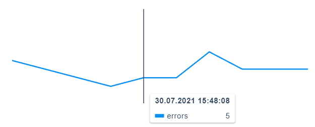
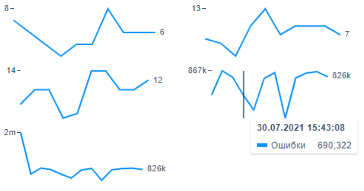
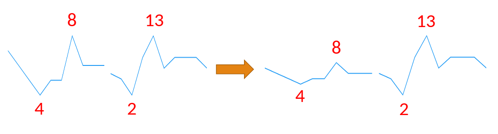

# React Component Sparkline

Спарклайн – это вид графиков, который отличается своим маленьким размером, но плотной информативностью.

[Storybook](https://61982225496d77003aa71116-nwrcntrkqj.chromatic.com) 

Компонент:
- адаптивный и также принимает фиксированные размеры
- отображает верхнюю границу и максимальное значение по Y (большие числа обрабатываются)
- графики самостоятельные (по умолчанию) и могут синхронизироваться по оси Y

## Примеры

### Обязательные параметры
```
const categories = [ 1627648088000, 1627648388000, 1627648688000, 1627648988000, 1627649288000, 1627649588000, 1627649888000, 1627650188000, 1627650488000, 1627650788000, 1627651088000, 1627651388000];

<Sparkline
    name="errors"                           // название графика
    categories={categories}                 // массив дат (timestamp)
    data={[7, 6, 5, 4, 5, 5, 8, 6, 6, 6]}   // массив значений
/>
```



### Значения осей
```
<Sparkline
    showTopValue={true}
    showLastValue={true}
/>
```



### Синхронизация графиков

Пример концепции до и после применения: значения накладываются под масштаб общей оси Y


```
const [state, dispatch] = useReducer(peakMetricsReducer, INIT_STATE);       // берется из SparklineProvider/context

<PeakMetricsContext.Provider value={{ state, dispatch }}>
    <Sparkline
        name="errors"                              // графики группируются по названиям
        categories={...}
        data={...}
        syncMode={SparklineSyncModes.}             // режим синхронизации
    />
    <Sparkline
        name="errors
        categories={...}
        data={...}
        syncMode={SparklineSyncModes.}
    />
</PeakMetricsContext.Provider>
```

Режимы синхронизации
```
enum SparklineSyncModes {
    off = 'off',                    // выключена
    max_min = 'max_min',            // по верхней и нижней границе
    max = 'max',                    // только по верхней
    min = 'min',                    // только по нижней
}
```

## Stack

React, TS, Sass, @visx/xychart, storybook
